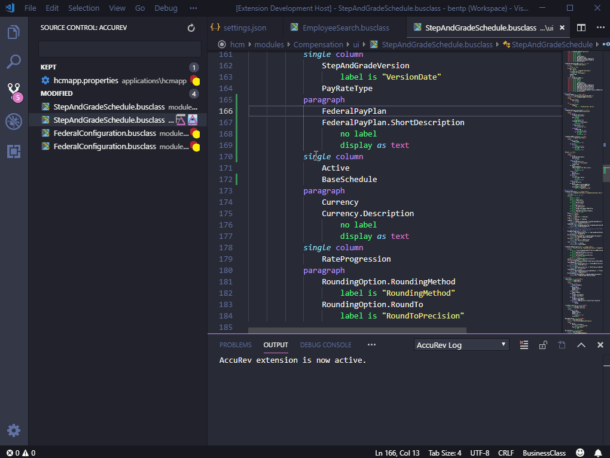

# Visual Studio Code AccuRev Extension README

This un-official extension allows some simple integration between Visual Studio Code and AccuRev source control. Note that this extension is not provided or approved by the owners of AccuRev.

## Features

* Automatically log into AccuRev if necessary and:
   * If AccuRev user name setting is provided in settings
   * If no password is required.

* AccuRev Output stream shows information about attempted AccuRev operations and status information.

* List in the Source Control view all files pending promotion (modified and kept files) within the current workspace, organized into "Kept" and "Modified" categories (Kept is similar to Git's staged status).

* Select any file in Source Control view to view changes against workspace's basis stream.

* Use inline command icon to view changes of modified files only against kept version instead of all changes against basis stream.

* Overlaps indicated by status icons in Source Control view.

* Quick-diff allows immediate visibility in any file loaded into the editor of lines that are changed versus the verion in the basis stream.

> Tip: Clicking on the colored bar in a source file where changes have occurred pops up quick-diff details.

## Requirements

* AccuRev must be installed.
* The Visual Studio Code workspace root must be within an AccuRev workspace.
* If `accurev.exe` is not in the system path, the path must be entered in the settings for this extension.
* User must either log into AccuRev separately, or must provide the user name in the extension settings of an account with no password.

## Extension Settings

This extension contributes the following settings:

* `accurev.enabled`: Turn on or off all features provided by this extension except the ability to listen for changes to `accurev.enabled`.
* `accurev.path`: The fully qualified path to `accurev.exe`. This is only required if `accurev.exe` is not in the system path.
* `accurev.userid`: The name used when attempting to automatically log in to AccuRev if attempts to interact with AccuRev report an expired or missing authentication token. This will only work for accounts that have no password (the password for automatic logins is always assumed to be blank).

## Known Issues

* There is currently no means of keeping, promoting or merging code, only viewing changes.
* There is currently no way of including external files, which would be pointless right now anyway with the lack of ability to keep or promote changes.
* Even though there is no ability to promote or keep code, a textbox at the top of the source control view for entering promote comments is visible.
* Refreshing the source control view must be done explicitly with a refresh button in the title area rather than implicitly when files are changed.

## Release Notes

### 0.0.1

- Initial release 0.0.1 on 2019-03-08 is intended for alpha/beta testing.
- See [Change Log](CHANGELOG.md) for details.

-----------------------------------------------------------------------------------------------------------

## Working with Markdown

**Note:** You can author your README using Visual Studio Code.  Here are some useful editor keyboard shortcuts:

* Split the editor (`Cmd+\` on macOS or `Ctrl+\` on Windows and Linux)
* Toggle preview (`Shift+CMD+V` on macOS or `Shift+Ctrl+V` on Windows and Linux)
* Press `Ctrl+Space` (Windows, Linux) or `Cmd+Space` (macOS) to see a list of Markdown snippets

### For more information

* [Visual Studio Code's Markdown Support](http://code.visualstudio.com/docs/languages/markdown)
* [Markdown Syntax Reference](https://help.github.com/articles/markdown-basics/)

**Enjoy!**
